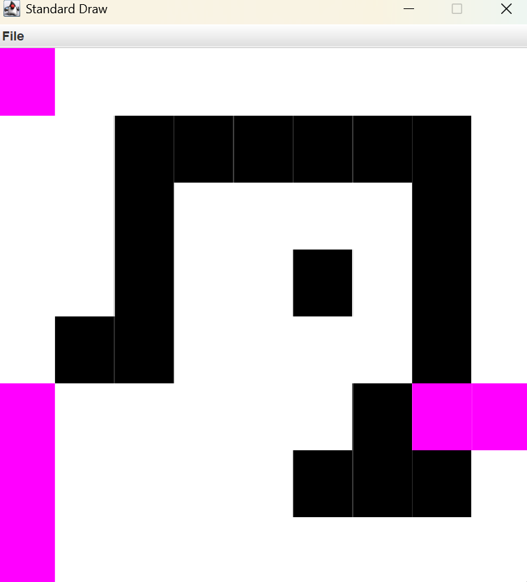

I2CS_Ex2

### 
## 👓 Description:
2D Grid Pathfinding & Manipulation System This project implements a graphical tool for grid-based operations using Object-Oriented Programming (OOP) and the StdDraw library. At its core, the system represents a 2D pixel matrix and leverages the Breadth-First Search (BFS) algorithm to solve spatial problems. Key functionalities include:

Shortest Pathfinding: Calculating the optimal route between two points.

Distance Mapping: Generating a complete distance field from a source point.

Connected Component Filling: Implementing a "Flood Fill" algorithm to update regions of identical colors.

## result: 
By running Ex2_GUI, you can:
Calculate Optimal Routes: Navigate between any two points on the map using a BFS-based shortest path algorithm.

🏷️Modify Map Topology: Switch between a standard flat grid and a Cyclic (wrap-around) mode where edges are connected.

🏷️Perform Intelligent Area Fills: Use the "Flood Fill" tool to instantly recolor connected regions of the same color.

🏷️Visualize Distance Fields: Generate a complete distance map from a source point to understand the cost of travel across the entire grid.

🏷️Manage Map Data: Create, save, and reload custom map configurations through the integrated file I/O system.

🏷️Interactive Graphics: Watch algorithms work in real-time through a clear, color-coded visual interface.
🏷

The graphical interface provides an intuitive way to interact with complex graph algorithms, making abstract data structures visible and easy to understand.

